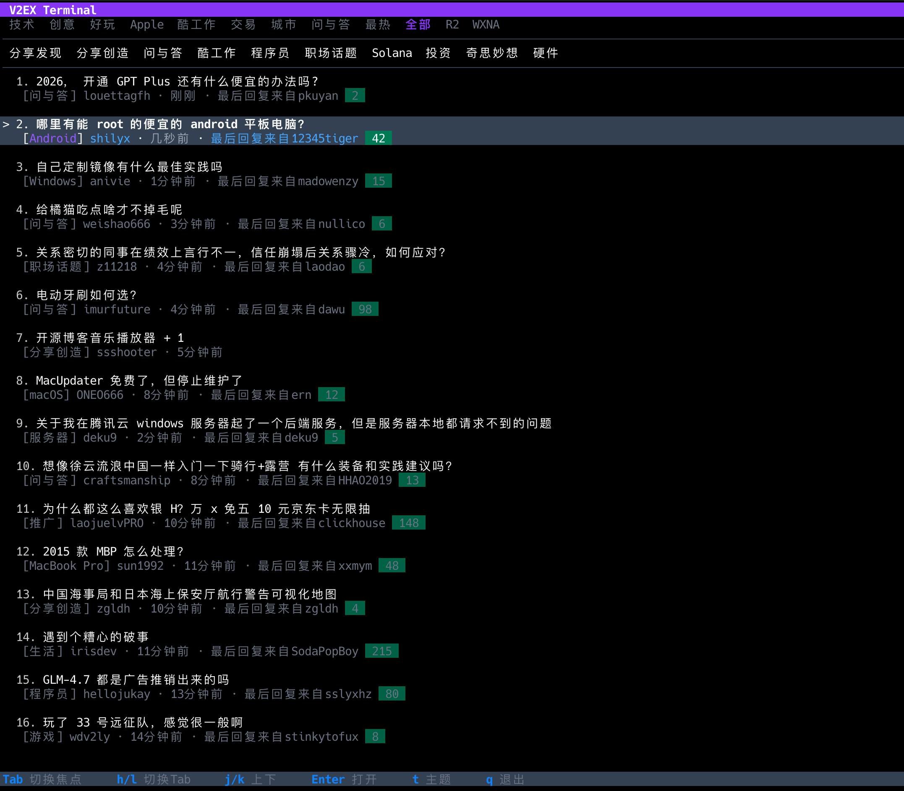

# V2EX TUI

一个现代化的 V2EX 终端客户端，基于 [Bubble Tea](https://github.com/charmbracelet/bubbletea) 框架构建。




## 核心特性

- **Vim 风格导航** - 全键盘操作，hjkl 移动，无需鼠标
- **双层导航设计** - 一级 Tab 分类 + 二级节点导航，复刻 V2EX 官网布局
- **无限滚动加载** - 帖子列表和回复内容滚动到底部自动加载下一页，流畅阅读体验
- **深色/浅色主题** - 一键切换，适应不同环境和偏好
- **终端超链接** - 支持 OSC 8 协议，标题和链接可直接点击跳转
- **响应式布局** - 自适应终端窗口大小
- **简洁 UI 设计** - 标题突出，元信息弱化，聚焦内容本身

## 安装

```bash
go install github.com/six-ddc/v2ex-tui@latest
```

或从源码构建：

```bash
git clone https://github.com/six-ddc/v2ex-tui.git
cd v2ex-tui
go build -o v2ex-tui
```

## 使用

```bash
./v2ex-tui
```

## 快捷键

### 全局

| 快捷键 | 功能 |
|--------|------|
| `q` / `Esc` | 返回/退出 |
| `Tab` | 切换焦点区域 |
| `Shift+Tab` | 反向切换焦点 |
| `r` | 刷新当前视图 |
| `t` | 切换深色/浅色主题 |

### 导航栏

| 快捷键 | 功能 |
|--------|------|
| `h` / `←` | 向左切换 |
| `l` / `→` | 向右切换 |
| `Enter` | 选中当前项 |
| `1-9, 0` | 快速跳转到对应 Tab |

### 主题列表

| 快捷键 | 功能 |
|--------|------|
| `j` / `↓` | 向下移动 |
| `k` / `↑` | 向上移动 |
| `Enter` / `l` | 打开帖子 |
| `g` | 跳到顶部 |
| `G` | 跳到底部（节点模式下自动加载更多） |
| `Ctrl+D` | 向下翻半页 |
| `Ctrl+U` | 向上翻半页 |
| `Ctrl+F` / `Space` | 向下翻页 |
| `Ctrl+B` | 向上翻页 |

### 帖子详情

| 快捷键 | 功能 |
|--------|------|
| `j` / `k` | 滚动内容 |
| `g` / `G` | 跳到顶部/底部（自动加载更多回复） |
| `[` / `]` | 上一篇/下一篇帖子 |
| `o` | 在浏览器中打开 (macOS) |
| `q` | 返回列表 |

## 亮点

### 无限滚动

在节点模式下浏览帖子列表，或在详情页阅读回复时，滚动到底部会自动加载下一页内容，无需手动操作，体验如同现代网页应用。

### 终端友好

遵循终端应用最佳实践：只设置前景色，让终端背景色生效。无论你使用什么终端主题（Dracula、Solarized、Nord...），都能获得一致的阅读体验。

### 快速导航

- 数字键 `1-0` 直接跳转到对应 Tab
- `g`/`G` 快速跳到顶部/底部
- `[`/`]` 在详情页快速切换上下篇帖子

## 依赖

- [Bubble Tea](https://github.com/charmbracelet/bubbletea) - TUI 框架
- [Lip Gloss](https://github.com/charmbracelet/lipgloss) - 样式库
- [Bubbles](https://github.com/charmbracelet/bubbles) - TUI 组件库
- [goquery](https://github.com/PuerkitoBio/goquery) - HTML 解析
- [resty](https://github.com/go-resty/resty) - HTTP 客户端

## 许可证

MIT License
