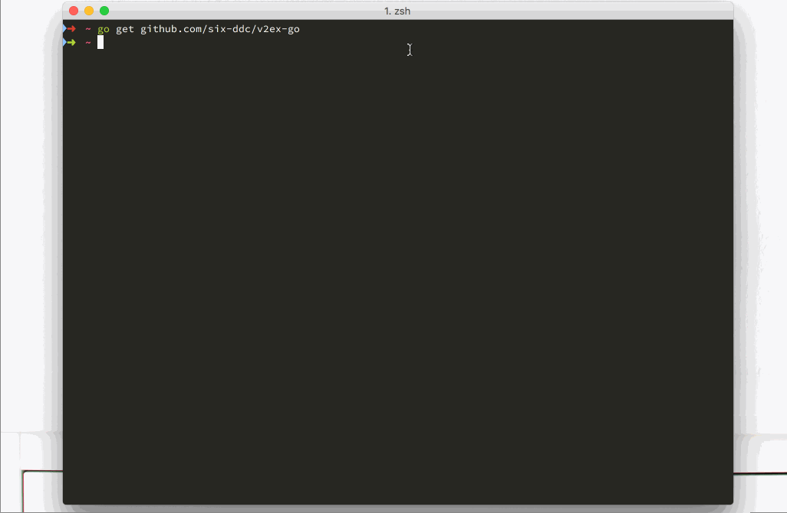

## v2ex-go



#### 安装

``` shell
# 由于golang.org被墙，安装时可能需要梯子
go get github.com/six-ddc/v2ex-go
cd $GOPATH/bin
./v2ex-go
```

* 或者直接下载对应的二进制 [Release包](https://github.com/six-ddc/v2ex-go/releases)


#### 使用

* 支持登录，修改[user]配置，然后`C-l`右下角可以查看用户基本信息
* 查看节点，`C-t` 切换到tab栏，然后输入`字母`选择对应的tab和节点，`回车`打开
* 查看回复，输入`字母`或者`数字编号`选择匹配主题，`C-n`切换结果，`回车`打开
* 节点翻页，`C-f`滚动到页尾，然后再次`C-f`即加载下一页 （tab主题不支持翻页）
* 回复翻页，主题回复页面，默认加载最后一页，`C-b`滚动到上一页
* `C-r`刷新主题或回复页面
* `C-p`切换主题和回复页面
* `C-q`退出

更多快捷键，参考`config.default.ini`，里面有所有快捷键的介绍

也可以重命名为`config.ini`，并拷贝到执行文件所在目录，进行自定义配置。

